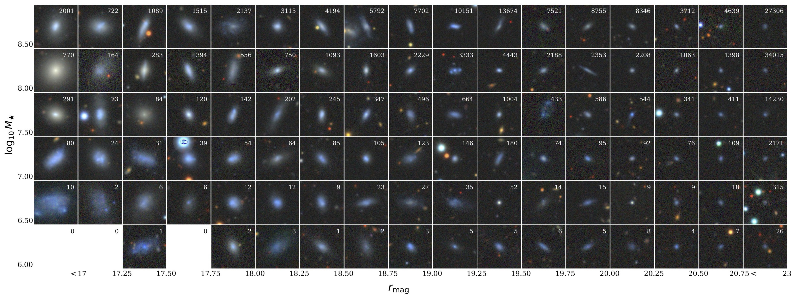

# DESI Extragalactic Dwarf Galaxy Catalog

**Contact:** Viraj Manwadkar ([virajvm@stanford.edu](mailto:virajvm@stanford.edu))

The DESI Extragalactic Dwarf Galaxy Catalog provides spectroscopically confirmed dwarf galaxies from the Dark Energy Spectroscopic Instrument (DESI) Data Release 1. The catalog includes reprocessed photometry, spectral measurements, and value-added properties for low-mass galaxies with $\log(M_\star / M_\odot) < 9.25$. The catalog is stored as a multi-extension FITS file with eight extensions: **MAIN**, **ZCAT**, **TRACTOR**, **FASTSPEC**, **REPROCESS_PHOTO**, **SPECTRA_TEMPLATE**, **IMG_SSL**, and **SPEC_DERIVED**.

  

<em>Example dwarf galaxies in the DESI DR1 Extragalactic Dwarf Galaxy Catalog.</em>

---

### [Interactive Catalog Viewer](https://virajvman.github.io/desidwarfs_webapp/interactive.html)

Explore the DESI Dwarf Galaxy catalog interactively in your browser.

---

### Data Access

**NERSC** &mdash; The catalog and companion data products are available at the following paths on the NERSC Perlmutter filesystem:

| Product | Path |
| :------ | :--- |
| Main Catalog (FITS) | `/pscratch/sd/v/virajvm/desi_dwarf_catalogs/dr1/v1.0/desi_dr1_dwarf_catalog.fits` |
| Spectra (HDF5) | `/pscratch/sd/v/virajvm/catalog_dr1_dwarfs/iron_spectra/spectra_files/data/desi_dr1_dwarf_catalog_spectra.h5` |
| Image Cutouts (HDF5) | `/pscratch/sd/v/virajvm/catalog_dr1_dwarfs/ssl_shred_data/desi_dr1_dwarf_catalog_images.h5` |

<!-- TODO: add Zenodo / public download links here -->

---

<h3>Catalog Data Model</h3>

 

The catalog is a multi-extension FITS file. Each extension is keyed by `TARGETID` and described below.

<strong>Extension 1 &mdash; MAIN</strong>

 

Core identifiers, coordinates, redshifts, stellar masses, photometry, and quality flags.

| Name | Type | Units | Description |
| :--- | :--- | :---: | :---------- |
| `TARGETID` | int64 | | DESI TARGET ID |
| `SURVEY` | str | | Survey name |
| `PROGRAM` | str | | Program name |
| `HEALPIX` | int32 | | HEALPix index at NSIDE=64 in the NESTED scheme |
| `Z` | float64 | | Redrock redshift (heliocentric) |
| `DELTACHI2` | float64 | | Redrock delta-chi-squared |
| `ZWARN` | int8 | | Redrock zwarning bit |
| `Z_CMB` | float64 | | Redrock redshift (CMB rest frame) |
| `RA` | float64 | deg | Right Ascension of the galaxy. Same as target catalog, except for galaxies reprocessed after being identified as likely shredded |
| `DEC` | float64 | deg | Declination of the galaxy. Same as target catalog, except for galaxies reprocessed after being identified as likely shredded |
| `RA_TARGET` | float64 | deg | Right Ascension from target catalog |
| `DEC_TARGET` | float64 | deg | Declination from target catalog |
| `DESINAME` | str | | DESI object name |
| `LUMI_DIST_MPC` | float32 | Mpc | Fiducial luminosity distance |
| `DIST_SOURCE` | str | | Source of the luminosity distance. One of: `NED_ZIND`, `VIRGO_SBF`, `VIRGO_EVCC`, `CF3_NAM`, `V_CMB` |
| `LOG_MSTAR_SAGA` | float32 | $\log(M_\odot)$ | Log stellar mass using `LUMI_DIST_MPC` and the SAGA *gr*-based approximation |
| `LOG_MSTAR_M24` | float32 | $\log(M_\odot)$ | Log stellar mass (de los Reyes et al. 2024 *gr* relation). Default: nebular/filter/k-corrected photometry with z=0 in the mass function. If `MSTAR_MASKBIT` bit 0 (low continuum SNR in fiber photometry) or bit 2 (unreliable nebular correction, \|`DELTA_MAG_{G,R}_NEB`\| > 2) is set, mass uses aggregate `MAG_G`/`MAG_R`, `LUMI_DIST_MPC`, and `Z_CMB` with polynomial *g*-band k-correction in `get_stellar_mass_mia` instead of that delta-mag path. |
| `LOG_MSTAR_M24_ERR` | float64 | dex | Uncertainty from nebular correction errors in emission-subtracted fiber photometry. **Placeholder:** set to **0** for objects on the low-SNR fallback mass path (bit 0); a proper uncertainty for that path is not yet implemented. |
| `MAG_G` | float32 | mag | *g*-band magnitude (MW extinction corrected). Same as Tractor photometry, except for galaxies reprocessed after being identified as likely shredded |
| `MAG_R` | float32 | mag | Same as `MAG_G` but for *r*-band |
| `MAG_Z` | float32 | mag | Same as `MAG_G` but for *z*-band |
| `MAG_G_TARGET` | float32 | mag | Tractor *g*-band magnitude of DESI target source (MW extinction corrected). For shredded sources, this is the uncorrected, shredded photometry |
| `MAG_R_TARGET` | float32 | mag | Same as `MAG_G_TARGET` but for *r*-band |
| `MAG_Z_TARGET` | float32 | mag | Same as `MAG_G_TARGET` but for *z*-band |
| `IS_BGS_BRIGHT` | bool | | Whether the target is in the **BGS_BRIGHT** target list. From ZCAT `BGS_TARGET` (main survey) OR `SV{1,2,3}_BGS_TARGET`. Computed for every row; **non-exclusive** (a target can belong to several lists). See [target-list membership flags](#target-list-membership-flags). |
| `IS_BGS_FAINT` | bool | | Whether the target is in the **BGS_FAINT** target list. From ZCAT `BGS_TARGET` (main survey) OR `SV{1,2,3}_BGS_TARGET`. Non-exclusive. |
| `IS_LOWZ` | bool | | Whether the target is in the **LOWZ** secondary target list. From ZCAT `SCND_TARGET` (main survey) OR `SV{1,2,3}_SCND_TARGET` bits 15/16/17. Non-exclusive. |
| `IS_ELG` | bool | | Whether the target is in the **ELG** target list. From ZCAT `DESI_TARGET` (main survey) OR `SV{1,2,3}_DESI_TARGET`. Non-exclusive. |
| `IS_OTHER` | bool | | Whether the object entered the catalog via the **QSO/SCND** hidden-dwarf-candidate branch (provenance flag, mirrors `IN_SGA_2020`). Not a targeting-bit membership flag. See [OTHER sample](#other-sample-is_other). |
| `DWARF_MASKBIT` | int32 | | Bitwise mask for cleaning cuts. See [bitmask descriptions](#dwarf_maskbit-descriptions) |
| `MSTAR_MASKBIT` | int32 | | Bitwise mask for the `LOG_MSTAR_M24` derivation. See [MSTAR_MASKBIT descriptions](#mstar_maskbit-descriptions) |
| `MAG_TYPE` | str | | Photometry method used for `MAG_G/R/Z`. See [MAG_TYPE descriptions](#mag-type-descriptions) |
| `PHOTOMETRY_UPDATED` | bool | | Whether photometry was updated from original target Tractor photometry |
| `R50_R` | float32 | arcsec | Half-light radius in *r*-band |
| `SHAPE_PARAMS` | float32 (2,) | | Galaxy shape `[b/a, PA]`: axis ratio and major-axis position angle in **degrees East of North, range [0, 180)**. Folded to this single convention across all photometry types; the raw Tractor `PHI` (TRACTOR HDU, `[−90, 90]`) is the same orientation modulo 180°. |
| `IN_SGA_2020` | bool | | Whether Tractor `MASKBITS=12` is set (bright-galaxy neighbor association in imaging) |
| `ASSOCIATED_TARGETIDS` | object | | List of associated TARGETIDs (variable-length per row) |
| `DWARF_PRIMARY_TARGETID` | int64 | | TARGETID of the primary fiber, chosen as the brightest `MAG_R_TARGET` among associated fibers |
| `DWARF_PRIMARY` | bool | | Whether this row is the primary fiber (`TARGETID == DWARF_PRIMARY_TARGETID`) |

---

<strong>Extension 2 &mdash; ZCAT</strong>

 

Redshift catalog columns, targeting bits, and observation metadata. **Targeting bits** (`DESI_TARGET`, `BGS_TARGET`, `SCND_TARGET`, SV-era columns, etc.) are the authoritative raw source of bit membership; the MAIN `IS_BGS_BRIGHT` / `IS_BGS_FAINT` / `IS_LOWZ` / `IS_ELG` flags are derived directly from them. Use these ZCAT columns for any finer-grained bit membership not captured by those flags. Rows match **MAIN** by `TARGETID` and order.

| Name | Type | Units | Description |
| :--- | :--- | :---: | :---------- |
| `TARGETID` | int64 | | DESI TARGET ID |
| `CMX_TARGET` | int64 | | Commissioning (CMX) targeting bit |
| `DESI_TARGET` | int64 | | DESI targeting bit |
| `BGS_TARGET` | int64 | | BGS targeting bit |
| `MWS_TARGET` | int64 | | MWS targeting bit |
| `SCND_TARGET` | int64 | | Secondary target targeting bit |
| `SV1_DESI_TARGET` | int64 | | SV1 DESI targeting bit |
| `SV1_BGS_TARGET` | int64 | | SV1 BGS targeting bit |
| `SV1_MWS_TARGET` | int64 | | SV1 MWS targeting bit |
| `SV2_DESI_TARGET` | int64 | | SV2 DESI targeting bit |
| `SV2_BGS_TARGET` | int64 | | SV2 BGS targeting bit |
| `SV2_MWS_TARGET` | int64 | | SV2 MWS targeting bit |
| `SV3_DESI_TARGET` | int64 | | SV3 DESI targeting bit |
| `SV3_BGS_TARGET` | int64 | | SV3 BGS targeting bit |
| `SV3_MWS_TARGET` | int64 | | SV3 MWS targeting bit |
| `SV1_SCND_TARGET` | int64 | | SV1 secondary targeting bit |
| `SV2_SCND_TARGET` | int64 | | SV2 secondary targeting bit |
| `SV3_SCND_TARGET` | int64 | | SV3 secondary targeting bit |
| `TSNR2_LRG` | float32 | | LRG template (S/N)^2 summed over B, R, Z |
| `CHI2` | float32 | | Best-fit Redrock chi-squared |
| `OBJTYPE` | str | | Object type: TGT, SKY, NON, BAD |
| `OBSCONDITIONS` | int32 | | Flag the target to be observed in graytime |
| `COADD_NUMEXP` | int16 | | Number of exposures in coadd |
| `COADD_EXPTIME` | float32 | s | Summed exposure time for coadd |
| `COADD_NUMTILE` | int16 | | Number of tiles in coadd |
| `MEAN_PSF_TO_FIBER_SPECFLUX` | float32 | | Mean fraction of light from point-like source captured by 1.5 arcsec diameter fiber given atmospheric seeing |
| `MIN_MJD` | float64 | d | Minimum MJD of the first exposure used in the coadded spectrum |
| `MAX_MJD` | float64 | d | Maximum MJD of the last exposure used in the coadded spectrum |
| `MEAN_MJD` | float64 | d | Mean MJD over exposures used in the coadded spectrum |
| `ZCAT_NSPEC` | int16 | | Number of times this TARGETID appears in this catalog |
| `ZCAT_PRIMARY` | bool | | Primary coadded spectrum flag in zpix zcatalog |

---

<strong>Extension 3 &mdash; TRACTOR</strong>

 

Original Tractor photometry and morphological parameters from the DESI Legacy Surveys DR9.

| Name | Type | Units | Description |
| :--- | :--- | :---: | :---------- |
| `TARGETID` | int64 | | DESI TARGET ID |
| `RELEASE` | int16 | | Integer denoting the camera and filter set used, unique for a given processing run |
| `BRICKNAME` | str | | Name of the sky brick, encoding RA and Dec (e.g., `1126p222`) |
| `BRICKID` | int32 | | Integer ID of the brick [1--662174] |
| `BRICK_OBJID` | int32 | | Catalog object number within this brick. Unique when combined with `RELEASE` and `BRICKID` |
| `EBV` | float32 | mag | Galactic extinction E(B-V) reddening from SFD98 |
| `FIBERFLUX_R` | float32 | nanomaggy | Predicted *r*-band flux within a 1.5 arcsec diameter fiber under 1 arcsec Gaussian seeing (not extinction corrected) |
| `FIBERTOTFLUX_G` | float32 | nanomaggy | Total *g*-band flux in the DESI fiber aperture (Tractor; **not** Milky Way extinction corrected). Filled from stacked `_INT_V2.fits` subsample tables via sky match to `RA_TARGET`/`DEC_TARGET` with `TARGETID` agreement within 1 arcsec; NaN if no match |
| `FIBERTOTFLUX_R` | float32 | nanomaggy | Total *r*-band flux in the DESI fiber aperture (Tractor; **not** Milky Way extinction corrected). Same provenance as `FIBERTOTFLUX_G` |
| `MASKBITS` | int16 | | Tractor bitwise mask from coadd maskbits maps ([DR9 bitmasks](https://www.legacysurvey.org/dr9/bitmasks/)) |
| `REF_ID` | int64 | | Reference catalog source ID (Tycho-2 or Gaia DR2) |
| `REF_CAT` | str | | Reference catalog: `T2` (Tycho-2), `G2` (Gaia DR2), `L3` (large-galaxy imaging reference), or empty |
| `FLUX_G` | float32 | nanomaggy | Total *g*-band flux (extinction corrected) |
| `FLUX_IVAR_G` | float32 | 1/nanomaggy² | Inverse variance of `FLUX_G` |
| `MAG_G` | float32 | mag | Extinction-corrected *g*-band magnitude |
| `MAG_G_ERR` | float32 | mag | Uncertainty in *g*-band magnitude |
| `FLUX_R` | float32 | nanomaggy | Total *r*-band flux (extinction corrected) |
| `FLUX_IVAR_R` | float32 | 1/nanomaggy² | Inverse variance of `FLUX_R` |
| `MAG_R` | float32 | mag | Extinction-corrected *r*-band magnitude |
| `MAG_R_ERR` | float32 | mag | Uncertainty in *r*-band magnitude |
| `FLUX_Z` | float32 | nanomaggy | Total *z*-band flux (extinction corrected) |
| `FLUX_IVAR_Z` | float32 | 1/nanomaggy² | Inverse variance of `FLUX_Z` |
| `MAG_Z` | float32 | mag | Extinction-corrected *z*-band magnitude |
| `MAG_Z_ERR` | float32 | mag | Uncertainty in *z*-band magnitude |
| `FIBERMAG_R` | float32 | mag | Predicted *r*-band magnitude within 1.5 arcsec fiber (not extinction corrected) |
| `OBJID` | int32 | | Object number within the brick, unique within a given `RELEASE` and `BRICKID` |
| `SIGMA_G` | float32 | arcsec | Gaussian sigma of the object model in *g*-band |
| `FRACFLUX_G` | float32 | | Profile-weighted fraction of flux from neighboring sources in *g*-band |
| `RCHISQ_G` | float32 | | Reduced chi-squared of the *g*-band model fit |
| `SIGMA_R` | float32 | arcsec | Gaussian sigma of the object model in *r*-band |
| `FRACFLUX_R` | float32 | | Profile-weighted fraction of flux from neighboring sources in *r*-band |
| `RCHISQ_R` | float32 | | Reduced chi-squared of the *r*-band model fit |
| `SIGMA_Z` | float32 | arcsec | Gaussian sigma of the object model in *z*-band |
| `FRACFLUX_Z` | float32 | | Profile-weighted fraction of flux from neighboring sources in *z*-band |
| `RCHISQ_Z` | float32 | | Reduced chi-squared of the *z*-band model fit |
| `SHAPE_R` | float32 | arcsec | Half-light radius of the best-fit galaxy model (*r*-band) |
| `SHAPE_R_ERR` | float32 | arcsec | Uncertainty in the half-light radius (*r*-band) |
| `MU_R` | float32 | mag/arcsec² | Surface brightness within the effective radius in *r*-band |
| `MU_R_ERR` | float32 | mag/arcsec² | Uncertainty in the surface brightness (*r*-band) |
| `SERSIC` | float32 | | Sersic profile index (type=`SER`) |
| `SERSIC_IVAR` | float32 | | Inverse variance of the Sersic index |
| `BA` | float32 | | Axis ratio (*b/a*) of the best-fit galaxy model |
| `TYPE` | str | | Tractor morphological type |
| `PHI` | float32 | deg | Raw Tractor major-axis position angle, `0.5·arctan2(SHAPE_E2, SHAPE_E1)`, **range [−90, 90]** (DR10 ellipticity convention). Same on-sky orientation as the MAIN-HDU `SHAPE_PARAMS` PA, but the two differ by 180° where PA ∈ [90, 180); use `SHAPE_PARAMS[:,1]` for the science PA in [0, 180). |
| `NOBS_G` | int16 | | Number of images at the central pixel in *g*-band |
| `NOBS_R` | int16 | | Number of images at the central pixel in *r*-band |
| `NOBS_Z` | int16 | | Number of images at the central pixel in *z*-band |
| `MW_TRANSMISSION_G` | float32 | | Galactic transmission in *g* filter [0, 1] |
| `MW_TRANSMISSION_R` | float32 | | Galactic transmission in *r* filter [0, 1] |
| `MW_TRANSMISSION_Z` | float32 | | Galactic transmission in *z* filter [0, 1] |
| `SWEEP` | str | | Name of the sweep file this source was extracted from |

---

<strong>Extension 4 &mdash; FASTSPEC</strong>

 

Emission-line fitting results from **FastSpecFit**. This extension is the **FASTSPEC** HDU (HDU 3) of a custom FastSpecFit run on the DESI Iron / DR1 spectra, matched to **MAIN** by `TARGETID` and carried **verbatim** — every FASTSPEC-HDU column is included, with no subsetting. Rows match **MAIN** by `TARGETID` and order; targets with no FastSpecFit match are sentinel-filled so the row alignment is preserved.

The column definitions below follow the FastSpecFit data model (this run corresponds to the `fastspecfit` FASTSPEC-HDU schema, ~v3.x; see the [FastSpecFit FASTSPEC data model](https://fastspecfit.readthedocs.io/en/latest/fastspec.html)). Because the HDU is taken verbatim, columns are documented **by pattern** rather than enumerated one-by-one.

> **Note.** The stellar-population / SED quantities you may expect from FastSpecFit — `LOGMSTAR`, `SFR`, `DN4000*`, `ABSMAG*`, `KCORR*`, `VDISP`, rest-frame luminosities — live in the FastSpecFit **SPECPHOT** HDU (HDU 2), which is **not** carried in this catalog. Only the FASTSPEC HDU (HDU 3) is included here. The emission-subtracted fiber photometry (`MAG_*_FIBER_NOEMI`) measured by this project's pipeline lives in the **SPEC_DERIVED** extension, not here.

**Identification and quality columns**

| Name | Type | Units | Description |
| :--- | :--- | :---: | :---------- |
| `TARGETID` | int64 | | DESI TARGET ID (matches `MAIN.TARGETID` row-by-row) |
| `SURVEY` | bytes3 | | Survey name |
| `PROGRAM` | bytes6 | | Program name |
| `HEALPIX` | int32 | | HEALPix number (present for healpix coadds) |
| `SNR_B` / `SNR_R` / `SNR_Z` | float32 | | Median S/N per pixel in the *b* / *r* / *z* camera |
| `SMOOTHCORR_B` / `_R` / `_Z` | float32 | percent | Median smooth-continuum correction relative to the data in the *b* / *r* / *z* camera |
| `APERCORR` | float32 | | Median aperture correction factor |
| `APERCORR_G` / `APERCORR_R` / `APERCORR_Z` | float32 | | Aperture correction factor measured in the *g* / *r* / *z* band |
| `INIT_SIGMA_UV` / `INIT_SIGMA_NARROW` / `INIT_SIGMA_BALMER` | float32 | km/s | Initial line width for UV / forbidden+narrow-Balmer / broad-Balmer lines |
| `INIT_VSHIFT_UV` / `INIT_VSHIFT_NARROW` / `INIT_VSHIFT_BALMER` | float32 | km/s | Initial velocity shift for UV / narrow / broad-Balmer lines |
| `INIT_BALMER_BROAD` | bool | | Whether a broad Balmer line was initially identified in the spectral range |
| `DELTA_LINECHI2` | float32 | | Δχ² between the line model without vs. with broad lines |
| `DELTA_LINENDOF` | int32 | | Δ(degrees of freedom) without vs. with broad lines |
| `DELTA_KINECHI2` | float32 | | Δχ² between the constrained and relaxed-kinematics line model |
| `DELTA_KINENDOF` | int32 | | Δ(degrees of freedom) between the constrained and relaxed-kinematics model |

**Doublet line-ratios** — for `DOUBLET` ∈ {`MGII` (2796/2803), `OII` (3726/3729), `OIII` (5007/4959), `SII` (6731/6716), `NII` (6584/6548), `OIIRED` (7320/7330)}:

| Name | Type | Description |
| :--- | :--- | :---------- |
| `{DOUBLET}_DOUBLET_RATIO` | float32 | Doublet flux ratio |
| `{DOUBLET}_DOUBLET_RATIO_IVAR` | float32 | Inverse variance of the ratio |

**Per-emission-line columns** — every fitted line (full list below) carries the following `{LINE}_*` columns:

| Name | Type | Units | Description |
| :--- | :--- | :---: | :---------- |
| `{LINE}_MODELAMP` | float32 | 1e-17 erg/(Å cm² s) | Model line amplitude (before convolution with the resolution matrix) |
| `{LINE}_AMP` | float32 | 1e-17 erg/(Å cm² s) | Emission-line amplitude |
| `{LINE}_AMP_IVAR` | float32 | 1e+34 Ų cm⁴ s²/erg² | Inverse variance of `{LINE}_AMP` |
| `{LINE}_FLUX` | float32 | 1e-17 erg/(cm² s) | Gaussian-integrated emission-line flux |
| `{LINE}_FLUX_IVAR` | float32 | 1e+34 cm⁴ s²/erg² | Inverse variance of `{LINE}_FLUX` |
| `{LINE}_BOXFLUX` | float32 | 1e-17 erg/(cm² s) | Boxcar-integrated emission-line flux |
| `{LINE}_BOXFLUX_IVAR` | float32 | 1e+34 cm⁴ s²/erg² | Inverse variance of `{LINE}_BOXFLUX` |
| `{LINE}_VSHIFT` | float32 | km/s | Velocity shift relative to `Z` |
| `{LINE}_VSHIFT_IVAR` | float32 | s²/km² | Inverse variance of `{LINE}_VSHIFT` |
| `{LINE}_SIGMA` | float32 | km/s | Gaussian line width (before convolution with the resolution matrix) |
| `{LINE}_SIGMA_IVAR` | float32 | s²/km² | Inverse variance of `{LINE}_SIGMA` |
| `{LINE}_CONT` | float32 | 1e-17 erg/(Å cm² s) | Continuum flux at line center |
| `{LINE}_CONT_IVAR` | float32 | 1e+34 Ų cm⁴ s²/erg² | Inverse variance of `{LINE}_CONT` |
| `{LINE}_EW` | float32 | Å | Rest-frame equivalent width |
| `{LINE}_EW_IVAR` | float32 | 1/Ų | Inverse variance of `{LINE}_EW` |
| `{LINE}_FLUX_LIMIT` | float32 | erg/(cm² s) | 1σ upper limit on the line flux |
| `{LINE}_CHI2` | float32 | | χ² of the line fit |
| `{LINE}_NPIX` | int32 | | Number of pixels attributed to the line |

`{LINE}` runs over the 45 fitted lines: `NV_1240`, `OI_1304`, `SILIV_1396`, `CIV_1549`, `HEII_1640`, `ALIII_1857`, `SILIII_1892`, `CIII_1908`, `MGII_2796`, `MGII_2803`, `NEV_3346`, `NEV_3426`, `OII_3726`, `OII_3729`, `NEIII_3869`, `H6`, `H6_BROAD`, `HEPSILON`, `HEPSILON_BROAD`, `HDELTA`, `HDELTA_BROAD`, `HGAMMA`, `HGAMMA_BROAD`, `OIII_4363`, `HEI_4471`, `HEII_4686`, `HBETA`, `HBETA_BROAD`, `OIII_4959`, `OIII_5007`, `NII_5755`, `HEI_5876`, `OI_6300`, `SIII_6312`, `NII_6548`, `HALPHA`, `HALPHA_BROAD`, `NII_6584`, `SII_6716`, `SII_6731`, `ARIII_7135`, `OII_7320`, `OII_7330`, `SIII_9069`, `SIII_9532`.

**Flux moments** — the strong lines `CIV_1549`, `MGII_2800`, `HBETA`, `OIII_5007` additionally carry, for *n* = 1, 2, 3:

| Name | Type | Units | Description |
| :--- | :--- | :---: | :---------- |
| `{LINE}_MOMENT{n}` | float32 | Åⁿ | *n*-th moment of the continuum-subtracted flux within ±5σ of line center (1st = mean; 2nd / 3rd relative to the 1st) |
| `{LINE}_MOMENT{n}_IVAR` | float32 | 1/Ųⁿ | Inverse variance of `{LINE}_MOMENT{n}` |

---

<strong>Extension 5 &mdash; REPROCESS_PHOTO</strong>

 

Reprocessed photometry for sources whose photometry was updated. This extension only contains rows for galaxies with `PHOTOMETRY_UPDATED = True` in the MAIN extension.

| Name | Type | Units | Description |
| :--- | :--- | :---: | :---------- |
| `TARGETID` | int64 | | DESI TARGET ID |
| `COG_MAG_G_ISOLATE` | float32 | mag | COG magnitude in *g*-band (with isolate mask); MW extinction corrected |
| `COG_MAG_R_ISOLATE` | float32 | mag | COG magnitude in *r*-band (with isolate mask); MW extinction corrected |
| `COG_MAG_Z_ISOLATE` | float32 | mag | COG magnitude in *z*-band (with isolate mask); MW extinction corrected |
| `COG_MAG_G_NO_ISOLATE` | float32 | mag | COG magnitude in *g*-band (without isolate mask); MW extinction corrected |
| `COG_MAG_R_NO_ISOLATE` | float32 | mag | COG magnitude in *r*-band (without isolate mask); MW extinction corrected |
| `COG_MAG_Z_NO_ISOLATE` | float32 | mag | COG magnitude in *z*-band (without isolate mask); MW extinction corrected |
| `APER_R4_MAG_G_ISOLATE` | float32 | mag | R4 aperture magnitude in *g*-band (with isolate mask); MW extinction corrected |
| `APER_R4_MAG_R_ISOLATE` | float32 | mag | R4 aperture magnitude in *r*-band (with isolate mask); MW extinction corrected |
| `APER_R4_MAG_Z_ISOLATE` | float32 | mag | R4 aperture magnitude in *z*-band (with isolate mask); MW extinction corrected |
| `APER_R4_MAG_G_NO_ISOLATE` | float32 | mag | R4 aperture magnitude in *g*-band (without isolate mask); MW extinction corrected |
| `APER_R4_MAG_R_NO_ISOLATE` | float32 | mag | R4 aperture magnitude in *r*-band (without isolate mask); MW extinction corrected |
| `APER_R4_MAG_Z_NO_ISOLATE` | float32 | mag | R4 aperture magnitude in *z*-band (without isolate mask); MW extinction corrected |
| `TRACTOR_BASED_MAG_G_ISOLATE` | float32 | mag | Tractor-based parent magnitude in *g*-band (with isolate mask); MW extinction corrected |
| `TRACTOR_BASED_MAG_R_ISOLATE` | float32 | mag | Tractor-based parent magnitude in *r*-band (with isolate mask); MW extinction corrected |
| `TRACTOR_BASED_MAG_Z_ISOLATE` | float32 | mag | Tractor-based parent magnitude in *z*-band (with isolate mask); MW extinction corrected |
| `TRACTOR_BASED_MAG_G_NO_ISOLATE` | float32 | mag | Tractor-based parent magnitude in *g*-band (without isolate mask); MW extinction corrected |
| `TRACTOR_BASED_MAG_R_NO_ISOLATE` | float32 | mag | Tractor-based parent magnitude in *r*-band (without isolate mask); MW extinction corrected |
| `TRACTOR_BASED_MAG_Z_NO_ISOLATE` | float32 | mag | Tractor-based parent magnitude in *z*-band (without isolate mask); MW extinction corrected |
| `SIMPLE_PHOTO_MAG_G` | float32 | mag | Simple photometry magnitude in *g*-band (with isolate mask); MW extinction corrected |
| `SIMPLE_PHOTO_MAG_R` | float32 | mag | Simple photometry magnitude in *r*-band (with isolate mask); MW extinction corrected |
| `SIMPLE_PHOTO_MAG_Z` | float32 | mag | Simple photometry magnitude in *z*-band (with isolate mask); MW extinction corrected |
| `APERFRAC_R4_IN_IMG_ISOLATE` | float32 | | Fraction of R4 aperture inside image (with isolate mask) |
| `APERFRAC_R4_IN_IMG_NO_ISOLATE` | float32 | | Fraction of R4 aperture inside image (without isolate mask) |
| `COG_PARAMS_G_ISOLATE` | float32 (5,) | | COG fit parameters for *g*-band (with isolate mask) |
| `COG_PARAMS_R_ISOLATE` | float32 (5,) | | COG fit parameters for *r*-band (with isolate mask) |
| `COG_PARAMS_Z_ISOLATE` | float32 (5,) | | COG fit parameters for *z*-band (with isolate mask) |
| `COG_PARAMS_G_NO_ISOLATE` | float32 (5,) | | COG fit parameters for *g*-band (without isolate mask) |
| `COG_PARAMS_R_NO_ISOLATE` | float32 (5,) | | COG fit parameters for *r*-band (without isolate mask) |
| `COG_PARAMS_Z_NO_ISOLATE` | float32 (5,) | | COG fit parameters for *z*-band (without isolate mask) |
| `COG_PARAMS_G_ERR_ISOLATE` | float32 (5,) | | Errors on COG fit parameters for *g*-band (with isolate mask) |
| `COG_PARAMS_R_ERR_ISOLATE` | float32 (5,) | | Errors on COG fit parameters for *r*-band (with isolate mask) |
| `COG_PARAMS_Z_ERR_ISOLATE` | float32 (5,) | | Errors on COG fit parameters for *z*-band (with isolate mask) |
| `COG_PARAMS_G_ERR_NO_ISOLATE` | float32 (5,) | | Errors on COG fit parameters for *g*-band (without isolate mask) |
| `COG_PARAMS_R_ERR_NO_ISOLATE` | float32 (5,) | | Errors on COG fit parameters for *r*-band (without isolate mask) |
| `COG_PARAMS_Z_ERR_NO_ISOLATE` | float32 (5,) | | Errors on COG fit parameters for *z*-band (without isolate mask) |
| `COG_MAG_ERR_ISOLATE` | float32 (3,) | | COG magnitude errors in *g, r, z* (with isolate mask) |
| `COG_MAG_ERR_NO_ISOLATE` | float32 (3,) | | COG magnitude errors in *g, r, z* (without isolate mask) |
| `COG_SEG_ON_BLOB` | bool | | Whether object lies on the smoothed main blob used in COG analysis |
| `COG_FIT_RESID_ISOLATE` | float32 (3,) | | COG fit residuals for each band (with isolate mask) |
| `COG_DECREASE_MAX_LEN_ISOLATE` | float32 (3,) | | Maximum consecutive decrease length in COG for each band (with isolate mask) |
| `COG_DECREASE_MAX_MAG_ISOLATE` | float32 (3,) | | Magnitude decrease during maximum consecutive COG decrease (with isolate mask) |
| `COG_FIT_RESID_NO_ISOLATE` | float32 (3,) | | COG fit residuals for each band (without isolate mask) |
| `COG_DECREASE_MAX_LEN_NO_ISOLATE` | float32 (3,) | | Maximum consecutive decrease length in COG for each band (without isolate mask) |
| `COG_DECREASE_MAX_MAG_NO_ISOLATE` | float32 (3,) | | Magnitude decrease during maximum consecutive COG decrease (without isolate mask) |
| `APER_CEN_RADEC_ISOLATE` | float32 (2,) | deg | Aperture centroid (RA, Dec) (with isolate mask) |
| `APER_CEN_RADEC_NO_ISOLATE` | float32 (2,) | deg | Aperture centroid (RA, Dec) (without isolate mask) |
| `APER_PARAMS_ISOLATE` | float32 (3,) | pixels, ratio, rad | Aperture parameters: semi-major axis (pixels), *b/a* ratio, position angle in **radians** (raw photutils pixel-frame orientation; converted to East-of-North degrees when consolidated into `SHAPE_PARAMS`) (with isolate mask) |
| `APER_PARAMS_NO_ISOLATE` | float32 (3,) | pixels, ratio, rad | Aperture parameters: semi-major axis (pixels), *b/a* ratio, position angle in **radians** (raw photutils pixel-frame orientation; converted to East-of-North degrees when consolidated into `SHAPE_PARAMS`) (without isolate mask) |
| `APER_SOURCE_ON_ORG_BLOB` | bool | | Whether DESI source lies on the unsmoothed detection blob |
| `NEAREST_STAR_NORM_DIST` | float32 | | Distance to nearest star in units of the star masking radius |
| `NEAREST_STAR_MAX_MAG` | float32 | mag | Brightest magnitude (across BP, RP, or G) of the nearest star |
| `NUM_TRACTOR_SOURCES_NO_ISOLATE` | int32 | | Number of Tractor sources in parent galaxy (without isolate mask) |
| `NUM_TRACTOR_SOURCES_ISOLATE` | int32 | | Number of Tractor sources in parent galaxy (with isolate mask) |
| `APER_R2_MU_R_ELLIPSE_TRACTOR` | float32 | | *r*-band surface brightness within R2 ellipse (Tractor model) |
| `APER_R2_MU_R_BLOB_TRACTOR` | float32 | | *r*-band surface brightness within segmented blob (Tractor model) |
| `APERFRAC_R4_IN_IMG_DATA_NO_ISOLATE` | float32 | | Fraction of R4 aperture on parent galaxy reconstruction (*g+r+z*) inside image |

---

<strong>Extension 6 &mdash; SPECTRA_TEMPLATE</strong>

 

Spectral template decomposition coefficients and UMAP coordinates.

| Name | Type | Units | Description |
| :--- | :--- | :---: | :---------- |
| `TARGETID` | int64 | | DESI TARGET ID |
| `NNMF_i` | float32 | | *i*-th NNMF spectral template coefficient (10 columns: `NNMF_0` ... `NNMF_9`) |
| `PCA_i` | float32 | | *i*-th PCA spectral template coefficient (20 columns: `PCA_0` ... `PCA_19`) |
| `SPEC_UMAP_0` | float32 | | Spectra 2D UMAP coordinate (*x*) |
| `SPEC_UMAP_1` | float32 | | Spectra 2D UMAP coordinate (*y*) |
| `NNMF_RESID` | float32 | | Residual norm of NNMF fit to spectra |
| `NNMF_NORM_FACTOR` | float32 | | Normalization factor used before fitting templates |

---

<strong>Extension 7 &mdash; IMG_SSL</strong>

 

Image-based self-supervised learning (SSL) UMAP coordinates and similarity search results. For each galaxy, the 10 most similar objects (by cosine similarity of SSL image representations) are listed in descending order of similarity. Missing values are filled with &minus;99 (int64 columns) or &minus;99.0 (float64 columns).

| Name | Type | Units | Description |
| :--- | :--- | :---: | :---------- |
| `TARGETID` | int64 | | DESI TARGET ID |
| `IMG_UMAP_0` | float64 | | Image SSL 2D UMAP coordinate (*x*) |
| `IMG_UMAP_1` | float64 | | Image SSL 2D UMAP coordinate (*y*) |
| `SIM_TARGETID_i` | int64 | | TARGETID of the *i*-th most similar object (10 columns: `SIM_TARGETID_0` ... `SIM_TARGETID_9`) |
| `SIM_SCORE_i` | float64 | | Cosine similarity score for the *i*-th most similar object (10 columns: `SIM_SCORE_0` ... `SIM_SCORE_9`) |

---

<strong>Extension 8 &mdash; SPEC_DERIVED</strong>

 

Spectroscopically **derived** value-added properties computed by [`code/add_nebular_props.py`](code/add_nebular_props.py) from the **MAIN**, **FASTSPEC**, and **TRACTOR** extensions: H-alpha star-formation rates, fiber stellar mass / SFR, strong-line and direct-method (electron-temperature) gas-phase metallicities, and the `DELTA_MAG_*` photometric corrections and `MAG_*_MODEL_*` model magnitudes used in the mass derivation. Rows match **MAIN** by `TARGETID` and order.

**Star formation and fiber properties**

| Name | Type | Units | Description |
| :--- | :--- | :---: | :---------- |
| `TARGETID` | int64 | | DESI TARGET ID (matches `MAIN.TARGETID` and `FASTSPEC.TARGETID` row-by-row) |
| `LOG_SFR_HALPHA` | float64 | $\log(M_\odot/\mathrm{yr})$ | log₁₀(SFR) from the Bauer et al. (2013) L(Hα) combined with a per-object, metallicity-dependent Hα→SFR calibration (BPASS; Korhonen Cuestas 2025). Calibration metallicity set from `MAIN.LOG_MSTAR_M24` via the Kirby+13 mass–metallicity relation (+0.2 dex young-population offset, Zahid et al. 2017). Global aperture-corrected SFR using `MAIN.MAG_R` and `LUMI_DIST_MPC` with per-row fiber `HALPHA_EW` from FASTSPEC |
| `LOG_SFR_HALPHA_ERR` | float64 | dex | 1σ uncertainty on `LOG_SFR_HALPHA` (first-order propagation; reflects Hα EW uncertainty only — the calibration constant is treated as exact) |
| `LOG_MSTAR_24_FIBER` | float32 | $\log(M_\odot)$ | log₁₀(stellar mass) within the DESI fiber aperture only |
| `LOG_HALPHA_SFR_FIBER` | float64 | $\log(M_\odot/\mathrm{yr})$ | log₁₀(SFR) within the fiber aperture only, using the same metallicity-dependent BPASS Hα→SFR calibration as `LOG_SFR_HALPHA` |
| `Z_GAS_R23_N2` | float64 | | Gas-phase strong-line metallicity 12+log(O/H) from R23+N2 (Scholte et al. 2024) using FASTSPEC Gaussian line fluxes, with internal dust correction when Hα/Hβ > 2.86. Filled where all seven required lines pass the SNR/flux gate; NaN otherwise |

**Emission-subtracted fiber photometry** — DECam AB magnitudes measured on the DESI fiber spectrum *after* subtracting the FastSpecFit emission-line model (computed by `compute_emission_subtracted_photo_errors`). Their `_ERR` values drive the continuum-SNR ≥ 10 split used for the fiber and aggregate stellar masses.

| Name | Type | Units | Description |
| :--- | :--- | :---: | :---------- |
| `MAG_G_FIBER_NOEMI` / `MAG_R_FIBER_NOEMI` | float64 | mag | DECam *g* / *r* AB magnitude from the emission-subtracted fiber spectrum |
| `MAG_G_FIBER_NOEMI_ERR` / `MAG_R_FIBER_NOEMI_ERR` | float64 | mag | Uncertainty in `MAG_G_FIBER_NOEMI` / `MAG_R_FIBER_NOEMI` |

**Photometric correction deltas** — added to the working magnitude during the mass derivation. North-only `BASS2DECAM` deltas are ~0 in the south; unmatched `TARGETID`s are NaN.

| Name | Type | Units | Description |
| :--- | :--- | :---: | :---------- |
| `DELTA_MAG_G_BASS2DECAM` / `DELTA_MAG_R_BASS2DECAM` | float64 | mag | BASS→DECam filter conversion (north only) |
| `DELTA_MAG_G_NEB` / `DELTA_MAG_R_NEB` | float64 | mag | Nebular-emission removal, from the FastSpecFit template difference |
| `DELTA_MAG_G_DECAM2SDSS` / `DELTA_MAG_R_DECAM2SDSS` | float64 | mag | DECam→SDSS filter conversion (continuum-only model) |
| `DELTA_MAG_G_KCORR` / `DELTA_MAG_R_KCORR` | float64 | mag | *k*-correction, SDSS observed-*z* to *z*=0 (continuum-only model) |

**Direct-method (electron-temperature) nebular properties** — populated only for rows passing the direct-method line gate (Hα, Hβ, Hγ, [OIII] 4363, [OIII] 5007, [OII] 3726, [OII] 3729 at sufficient SNR with flux > 1 in FastSpec units); all other rows are NaN / False / 0. Each quantity below also has `_LO` / `_HI` / `_ERR` siblings holding the 16th percentile, 84th percentile, and half the 84−16 spread of the UltraNest posterior.

| Name | Type | Units | Description |
| :--- | :--- | :---: | :---------- |
| `TE_NE_OII` (+`_LO`/`_HI`/`_ERR`) | float64 | cm⁻³ | Electron density from the [OII] 3729/3726 doublet (posterior median) |
| `TE_T_OIII` (+`_LO`/`_HI`/`_ERR`) | float64 | K | [OIII]-zone electron temperature from [OIII] 4363/5007 |
| `TE_AV` (+`_LO`/`_HI`/`_ERR`) | float64 | mag | *V*-band attenuation (Cardelli+89, R_V=3.1) from the Balmer decrements |
| `TE_LOG_O2_ABUND` (+`_LO`/`_HI`/`_ERR`) | float64 | | log₁₀(O⁺/H⁺) ionic abundance |
| `TE_LOG_O3_ABUND` (+`_LO`/`_HI`/`_ERR`) | float64 | | log₁₀(O⁺⁺/H⁺) ionic abundance |
| `TE_12_LOG_OH` (+`_LO`/`_HI`/`_ERR`) | float64 | | Direct-method 12+log(O/H) = 12+log₁₀(10^`TE_LOG_O2_ABUND` + 10^`TE_LOG_O3_ABUND`), computed per posterior sample |
| `TE_N_RATIOS` | int32 | | Number of usable line ratios fed to the fit (out of 6); 0 if no fit attempted |
| `TE_FIT_SUCCESS` | bool | | Whether the direct-method fit converged for this row |
| `TE_CHI2_AV` | float64 | | χ² of the observed Balmer ratios vs. the model at the posterior-median ne/Te/Av |
| `TE_CHI2_AV_ML` | float64 | | Same Balmer-ratio χ² evaluated at the maximum-likelihood ne/Te/Av (Stage-1 ML point) |
| `TE_AV_ML` | float64 | mag | Maximum-likelihood *V*-band attenuation (Stage-1 ML point) |
| `TE_ESS` | float64 | | UltraNest effective posterior sample size |
| `TE_LOGZ` | float64 | | UltraNest log-evidence (ln Z) of the fit |
| `TE_LOGZERR` | float64 | | 1σ uncertainty on `TE_LOGZ` |

**FastSpecFit model magnitudes** — AB magnitudes synthesized from the FastSpecFit best-fit model, matched by `TARGETID` to the pre-computed `model_photometry_diffs_*` tables; unmatched rows are NaN.

| Name | Type | Units | Description |
| :--- | :--- | :---: | :---------- |
| `MAG_G_DECAM_MODEL_NOEMI` / `MAG_R_DECAM_MODEL_NOEMI` | float64 | mag | DECam *g* / *r* of the continuum-only model (no emission lines) |
| `MAG_G_DECAM_MODEL_WEMI` / `MAG_R_DECAM_MODEL_WEMI` | float64 | mag | DECam *g* / *r* of the model including emission lines |
| `MAG_G_BASS_MODEL_WEMI` / `MAG_R_BASS_MODEL_WEMI` | float64 | mag | BASS *g* / *r* of the model including emission lines |
| `MAG_G_SDSS_MODEL_NOEMI` / `MAG_R_SDSS_MODEL_NOEMI` | float64 | mag | SDSS *g* / *r* of the continuum-only model at observed redshift |
| `MAG_G_SDSS_Z0_MODEL_NOEMI` / `MAG_R_SDSS_Z0_MODEL_NOEMI` | float64 | mag | SDSS *g* / *r* of the continuum-only model *k*-corrected to *z*=0 |

---

<h3>Image Cutouts</h3>

 

We provide 152 x 152 pixel *grz* image cutouts for all galaxies in the catalog with *z*-band magnitude < 20. The cutouts are stored in an HDF5 (`.h5`) file with the following datasets:

| Dataset | Shape | Type | Description |
| :------ | :---- | :--- | :---------- |
| `targetid` | (N,) | int64 | DESI TARGET ID (matches `TARGETID` in the catalog) |
| `images` | (N, 3, 152, 152) | float32 | Image cutouts in *g, r, z* bands (channels-first) |

For sources identified as shredded, the image cutouts have been recentered on the reconstructed parent galaxy center. Example code demonstrating how to read the HDF5 file and visualize the image cutouts is provided in the tutorials.

**NERSC path:** `$PSCRATCH/catalog_dr1_dwarfs/ssl_shred_data/desi_dr1_dwarf_catalog_images.h5`

---

<h3>Spectra</h3>

 

We provide camera-coadded (*b+r+z*) DESI spectra for all objects in the catalog. The spectra are stored in an HDF5 (`.h5`) file with the following datasets:

| Dataset | Shape | Type | Description |
| :------ | :---- | :--- | :---------- |
| `TARGETID` | (N,) | int64 | DESI TARGET ID (matches `TARGETID` in the catalog) |
| `Z` | (N,) | float32 | Redrock redshift |
| `WAVE` | (N_wave,) | float32 | Shared wavelength grid in Angstroms |
| `FLUX` | (N, N_wave) | float32 | Flux density in units of 10&minus;17 erg s&minus;1 cm&minus;2 &Aring;&minus;1 |
| `FLUX_IVAR` | (N, N_wave) | float32 | Inverse variance of `FLUX` |

Example code demonstrating how to read the HDF5 file and visualize the spectra is provided in the tutorials.

**NERSC path:** `$PSCRATCH/catalog_dr1_dwarfs/iron_spectra/spectra_files/data/desi_dr1_dwarf_catalog_spectra.h5`

---

### Additional Notes

#### Target-list membership flags (`IS_*`)

DESI targets are **not mutually exclusive**: the same `TARGETID` can carry multiple program bits (e.g. BGS bright/faint overlap, or BGS *and* LOWZ). Rather than a single label, MAIN therefore carries **independent boolean flags** — `IS_BGS_BRIGHT`, `IS_BGS_FAINT`, `IS_LOWZ`, `IS_ELG` — each derived **purely from the ZCAT targeting bits** (main survey **OR** SV1–SV3) and computed for **every** row. A target in both BGS_BRIGHT and LOWZ simply has both `IS_BGS_BRIGHT` and `IS_LOWZ` set; there is no priority ordering. These flags are added by `combine_hdus` (`_add_target_membership_flags` in `consolidate_photometry.py`), which also enforces **one row per `TARGETID`** (first occurrence in stack order kept).

`IS_OTHER` is different: it is a **provenance** flag (mirroring `IN_SGA_2020`), set when the object entered the catalog via the QSO/SCND hidden-dwarf-candidate branch (`load_and_filter_qso_scnd_candidates`) — *not* a targeting-bit membership. SGA-origin objects remain identifiable via `IN_SGA_2020`. The four bit flags plus these two provenance flags fully replace the former single `SAMPLE` label.

If you need **your own** sample definition (e.g. all targets with the ELG bit set regardless of this catalog’s single label), use the **ZCAT** extension: it includes **`DESI_TARGET`**, **`BGS_TARGET`**, **`MWS_TARGET`**, **`SCND_TARGET`**, and the **SV1–SV3** `*_DESI_TARGET` / `*_BGS_TARGET` / `*_MWS_TARGET` / `*_SCND_TARGET` columns, row-aligned with **MAIN** by `TARGETID`. Combine those bitmasks with `desitarget` (or your own masks) the same way you would on the spectroscopic zcatalog. For **custom DESI sample selection**, treat these **ZCAT** columns as the authoritative TARGET bitmasks on each row (same as zcatalog usage).

---

<strong>DWARF_MASKBIT Descriptions</strong>

 

Each bit in `DWARF_MASKBIT` corresponds to a quality or cleaning flag. A value of `1 << n` indicates bit `n` is set.

| Bit | Value | Description |
| :-: | ----: | :---------- |
| 0 | 1 | Curve of growth computation failed (NaN values) |
| 1 | 2 | Curve of growth likely not converged (APER R4 - COG > 0.5 mag) |
| 2 | 4 | Large residuals in curve of growth fit |
| 3 | 8 | Curve of growth decreases with increasing aperture |
| 4 | 16 | Large fraction of R4 aperture outside image bounds (>0.25) |
| 5 | 32 | Large fraction of pixels masked within R4 aperture (>0.33) |
| 6 | 64 | Large fraction of pixels in image cutout masked (>0.33) |
| 7 | 128 | Bad $g-r$ or $r-z$ colors (\|color\| > 2) |
| 8 | 256 | Source does not lie on segmented map |
| 9 | 512 | Source is likely shredded ($p_{\rm CNN} > 0.25$) and near bright star |
| 10 | 1024 | Aperture center lies in masked region |
| 11 | 2048 | No segmentation map found for source |
| 12 | 4096 | Source within twice the D26 of a cataloged large galaxy at the same redshift, without the Tractor bright-galaxy-neighbor bit |
| 13 | 8192 | Large reduced $\chi^2 > 10$ (at least one band) if using original Tractor photometry |
| 14 | 16384 | Low signal-to-noise detection (SNR > 5 in only one band or fewer) |
| 15 | 32768 | If `MAG_TYPE = TRACTOR_OG` and `TRACTOR_MASKBITS` has at least one of {8,9} [Tractor bits](https://www.legacysurvey.org/dr9/bitmasks/) flagged |
| 16 | 65536 | Likely incorrect Redrock redshift, identified via UMAP/NMF spectral template anomaly detection |
| 17 | 131072 | M_g &lt; &minus;18.5 at the survey redshift (or fallback distance for low continuum-SNR mass rows) after nebular + filter + k-corrections. |
| 18 | 262144 | Visually inspected (VI) and confirmed to have an incorrect redshift; TARGETID listed in data/vi_bad_tgids.txt |
| 19 | 524288 | Junk spectrum: FastSpecFit per-camera S/N `SNR_B`/`SNR_R`/`SNR_Z` &lt; 0 in at least two of the three arms. Per-fiber flag (kept from the row itself during associated-fiber consolidation). |
| 20 | 1048576 | Suspect spectrum: of the finite pixels of the observed coadd (median-smoothed on a 200 &Aring; scale, ivar&gt;0 only) with observed wavelength &lt; 4000 &Aring;, at least 75% lie below &minus;5 (in 10&minus;17 erg s&minus;1 cm&minus;2 &Aring;&minus;1) &mdash; an overwhelmingly negative blue continuum / normalization failure. Requires &ge;20 such finite blue pixels; objects with fewer are not assessed. Per-fiber flag (kept from the row itself during associated-fiber consolidation). |

<strong>MSTAR_MASKBIT Descriptions</strong>

 

Each bit in `MSTAR_MASKBIT` describes the stellar-mass pipeline used for `LOG_MSTAR_M24` (photometry, distance, and nebular/filter/k corrections tied to that fiber). Objects with bit 0 **or bit 2** use a **fallback** mass from aggregate `MAG_G`/`MAG_R`, `LUMI_DIST_MPC`, and `Z_CMB` (no delta-mag chain). After associated-fiber consolidation, `MSTAR_MASKBIT`, `LOG_MSTAR_M24`, and `LOG_MSTAR_M24_ERR` are copied together from the property-source row so flags stay aligned with the adopted mass.

| Bit | Value | Description |
| :-: | ----: | :---------- |
| 0 | 1 | Low continuum SNR in emission-subtracted *g* and *r* fiber photometry (mag error ≥ 1.0857/10, i.e. implied SNR &lt; 10 in those bands), from `compute_emission_subtracted_photo_errors` |
| 1 | 2 | M_g &lt; −18.5 at the survey redshift: `MAG_G` + `LUMI_DIST_MPC` + `g_kcorr`(`g−r`, `Z_CMB`). For rows with bit 0 or bit 2, this replaces the catalog-build bright cut; other rows match the delta-mag–based cut in `DWARF_MASKBIT` bit 17 at ingest. |
| 2 | 4 | Unreliable nebular correction: \|`DELTA_MAG_G_NEB`\| or \|`DELTA_MAG_R_NEB`\| &gt; 2 mag. The nebular emission subtraction is implausibly large, so the delta-mag chain is discarded and the mass is taken from the same fallback path as bit 0. |

<strong>MAG_TYPE Descriptions</strong>

 

| MAG_TYPE | Description |
| :------- | :---------- |
| `TRACTOR_OG` | Original Tractor DR9 photometry |
| `COG` | Remeasured photometry using curve-of-growth approach |
| `SIMPLE` | Remeasured photometry using curve-of-growth approach, but no color-based association criterion is used |
| `TRACTOR_BASED` | Remeasured photometry by summing fluxes of individual, associated Tractor sources |

See Manwadkar et al. 2026a for details.

### OTHER sample (`IS_OTHER = True`)

Rows with `IS_OTHER = True` are dwarf galaxies selected from **QSO** and **SCND** DESI targets that are **not** already in the primary dwarf sample (**BGS_BRIGHT**, **BGS_FAINT**, **LOWZ**, **ELG**). The discovery table is built with [`code/construct_other_dwarf_catalog.py`](code/construct_other_dwarf_catalog.py): the same maskbit, proper-motion, FRACFLUX (“shred”), RCHISQ, and SIGMA_GOOD cuts as before, plus **`NOBS_G` / `NOBS_R` / `NOBS_Z` exposure cuts** matching the primary INT_V2 pipeline, then NAM + independent distance updates, **`LOGM_M24_FIDU`**, sweeps, and bright-star flags. Intermediate output is **`iron_other_qso_scnd_candidates_INT_V2.fits`** (and the legacy combined file **`hidden_dwarf_candidates_qso_mws_scnd.fits`**); nebular correction follows the same **`iron_*_INT_V2_NEBCORR.fits`** pattern as other samples. When merging into the release catalog, [`load_and_filter_qso_scnd_candidates`](code/consolidate_photometry.py) deduplicates by `TARGETID`, **drops MWS**, matches FastSpecFit, and requires emission-line flux SNR cuts on Hα, Hβ, and [OIII] 5007.

