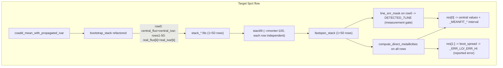

# Stack ivar propagation and bootstrap realizations (v2)

> **What changed from v1:** v1 was written before seeing `stack_direct_metallicity.py`. Having read it, the downstream **already implements the bootstrap-over-fits error correctly** (`res[1:]` + `boot_spread`); it is only dormant because the FITS currently has one row. This version (a) documents that data flow so it is preserved, (b) confirms there is **no nmonte/bootstrap double-counting**, and (c) adds three requirements the downstream now needs: edge-pixel masking, a bootstrap-reliability gate for the direct method, and a cost check on the per-row UltraNest fits.

## 0. Data-flow clarification — READ FIRST (do not "fix" the downstream error logic)

There are two independent error channels and they must stay separate:

- **Detection gate (measurement S/N):** `line_snr_mask(t[[0]], ...)` in `stack_direct_metallicity.py` uses the FastSpecFit per-line `*_FLUX_IVAR` (FSF `--nmonte=100`), which is driven by the input spectrum `ivar`. This decides **which bins are robustly *measured*** and worth fitting. After the ivar fix this becomes a true measurement-detection criterion (see §0.1).
- **Reported uncertainty (population spread):** `compute_direct_metallicities(t, ...)` returns one fit per FITS row — `res[0]` is the mean-stack fit (central values), `res[1:]` are the per-bootstrap-row fits. `_fill_param_errors`/`boot_spread` already take the **16/50/84 percentiles of the bootstrap-row posterior medians** as `{PARAM}_ERR_LO/_ERR_HI`. The mean-stack posterior interval is stored *separately* as `{PARAM}_MEANFIT_LO/HI` and is **not** combined with the bootstrap error.

So: **nmonte/measurement-ivar → gating + the informational `_MEANFIT_*` interval; bootstrap rows → the reported `_ERR_*`.** They are never added in quadrature. The downstream error logic is correct **as written** — do not change it. It is currently inactive only because `len(res)==1` (one FITS row) forces the `boot_ok = res[:0]` fallback to the posterior interval. Adding 50 bootstrap rows activates the bootstrap path automatically.

### 0.1 Expected side effect of the ivar fix on the detection gate

Switching the row-0 `ivar` from `1/boot_std²` (inflated at the emission lines, because population scatter piles up there) to the **propagated measurement ivar** raises the per-line S/N. Therefore **more bins will pass the `DETECTED_7LINE` gate** than before. This is correct and intended — the gate should reflect measurement detection, not population diversity — but flag it in the run log / answer.md so the change in the kept-bin set is expected, not alarming.

---

## Answers to Section 7 (also write to [answer.md](code/nebular_stuff/answer.md))

### 1. FastSpecFit invocation, output parsing, and the downstream error path

- **Invocation:** CLI in [`job_scripts/fastspec/run_stack_fastspec_haew_5pct.sh`](job_scripts/fastspec/run_stack_fastspec_haew_5pct.sh) — loops over `stack_ALL_mstar_*.fits`, runs `stackfit "$f" -o fastspec_${basename}` with `fastspecfit/3.4.2`, custom templates/constraints, `--nmonte=100`. `stackfit` fits each FITS row independently, so a 1+50-row input yields a 1+50-row `fastspec_stack_*` output. **No change needed to this script.**
- **Parsing + error reduction:** [`code/nebular_stuff/stack_direct_metallicity.py`](code/nebular_stuff/stack_direct_metallicity.py) reads HDU 3, gates on row 0 (`line_snr_mask`), fits all rows (`compute_direct_metallicities`), and reduces `res[1:]` to 16/50/84 percentiles via `boot_spread` (lines ~578–586 and `_fill_param_errors`). This is the bootstrap-over-fits we want; it is dormant only because there is currently one row.
- **No new ratio-aggregation script needed.**

### 2. Stack FITS schema / multi-row support
(unchanged from v1)
- [`write_stacked_spectra`](code/stacking_analysis/stack_explore.py) accepts 2D `flux`/`ivar` (`np.atleast_2d`) and writes `FLUX`, `IVAR`, `WAVE`, `STACKINFO` HDUs.
- **5pct (current prod):** [`write_single_row_fits`](code/nebular_stuff/stack_mstar_haew_5pct.py) writes 1 row with `ivar = 1/stack_err²` (the bug).
- **3bin (reference pattern):** [`stack_mstar_haew_3bin.py`](code/nebular_stuff/stack_mstar_haew_3bin.py) writes 1 + 50 rows (`IS_MEAN=1` on row 0); `stackfit` fits each row independently.
- **Action:** port the 3bin multi-row writer into 5pct, but with corrected per-row propagated ivar.

### 3. Existing bootstrap machinery
(unchanged from v1, both deviations confirmed correct)
- Core: [`bootstrap_stack`](code/stacking_analysis/stack_explore.py) (lines 304–400).
- **Correct:** `normalize_by_line_catalog` does `norm_ivar = ivar * H²` (line 296).
- **Bug:** `use_ivars` computed (line 371) but unused in coadd; `stacked_error = np.nanstd(all_stacks)` (line 398) drives FITS ivar via `1/err²`.
- **Fix (statistically important):** current code draws `n_draw = min(5000, n_valid)`; align to `n_draw = n_valid` (standard bootstrap). Drawing fewer than `n_valid` inflates each realization's scatter and would **overestimate** the errors.
- **Fix:** set `N_BOOTSTRAP = N_BOOT_SAVE = 50` directly (drop the 200→subsample-50 path).

### 4. `bootstrap_stack` signature / return
(unchanged from v1)
Current: `(stacked_flux, stacked_error, all_stacks)`. Planned: `(central_flux, boot_std, real_flux, real_ivar, central_ivar)`:
- `central_flux = np.nanmean(real_flux, axis=0)`
- `central_ivar = np.nanmean(real_ivar, axis=0)`  (Scholte step v: mean propagated ivar)
- `boot_std = np.nanstd(real_flux, axis=0)`  — **diagnostic only, never fed to FastSpecFit**
- `real_flux`, `real_ivar`: `(N_BOOT, N_wave)`
- Update `stack_mstar_haew_3bin.py`, `stack_mstar_haew.py`, `stack_mstar_elg_vs_noelg.py` to unpack the 5-tuple. **Note:** those scripts will still write `1/boot_std²` ivar until separately ported — treat their outputs as carrying the *old, incorrect* ivar, and verify the unpack edits don't route `boot_std` into a `1/err²` anywhere in those paths.

### 5. Emission-line column names
(unchanged from v1; verified in [`code/data_model.py`](code/data_model.py) lines 1417–1435)

| Line | Gaussian | Boxcar |
|------|----------|--------|
| [O III] 5007 | `OIII_5007_FLUX` | `OIII_5007_BOXFLUX` |
| Hβ | `HBETA_FLUX` | `HBETA_BOXFLUX` |
| Hα | `HALPHA_FLUX` | `HALPHA_BOXFLUX` |
| [S II] 6716/6731 | `SII_6716_FLUX`, `SII_6731_FLUX` | `SII_6716_BOXFLUX`, `SII_6731_BOXFLUX` |

Installed: `fastspecfit/3.4.2`. Production downstream uses `--line-flux-type BOXFLUX`.

---

## Architecture



---

## Implementation steps

### Step 1 — Add `coadd_mean_with_propagated_ivar` to [`stack_explore.py`](code/stacking_analysis/stack_explore.py)

Per-pixel `N(λ)`, valid mask on finite flux **and** `ivar > 0`:

```python
def coadd_mean_with_propagated_ivar(norm_flux, norm_ivar):
    """Unweighted mean coadd + propagated measurement ivar.
    norm_flux, norm_ivar: (N_gal, N_wave), already Hα-boxflux-normalized.
    Masked/uncovered pixels are returned as flux=0.0, ivar=0.0 (NOT NaN).
    """
    valid = np.isfinite(norm_flux) & (norm_ivar > 0)
    N = valid.sum(axis=0)                                   # contributing count per pixel

    f = np.where(valid, norm_flux, np.nan)
    mean = np.nanmean(f, axis=0)
    stack_flux = np.where(N > 0, mean, 0.0)                 # masked -> 0, not NaN

    var_i = np.where(valid, 1.0 / norm_ivar, np.nan)
    sum_var = np.nansum(var_i, axis=0)
    with np.errstate(divide="ignore", invalid="ignore"):
        stack_ivar = np.where((N > 0) & (sum_var > 0), N**2 / sum_var, 0.0)

    return stack_flux, stack_ivar
```

**Why `flux=0 / ivar=0` and not NaN:** different bootstrap resamples leave coverage gaps at slightly different grid edges, and `stackfit`/FastSpecFit treats `ivar=0` as masked but can choke on NaN *flux*. Use the standard masked convention `(flux=0, ivar=0)` consistently on every row. Confirm against how the current 1-row writer handles edges and keep it identical.

Place just before `bootstrap_stack`.

### Step 2 — Refactor `bootstrap_stack` in [`stack_explore.py`](code/stacking_analysis/stack_explore.py)

Replace lines ~392–398:

```python
real_flux = np.empty((n_bootstrap, n_wave))
real_ivar = np.empty((n_bootstrap, n_wave))
for b in range(n_bootstrap):
    idx = rng.integers(0, n_valid, size=n_valid)            # standard bootstrap (n_draw = n_valid)
    real_flux[b], real_ivar[b] = coadd_mean_with_propagated_ivar(
        use_fluxes[idx], use_ivars[idx]
    )
central_flux = np.nanmean(real_flux, axis=0)
central_ivar = np.nanmean(real_ivar, axis=0)
boot_std     = np.nanstd(real_flux, axis=0)                 # diagnostic only
return central_flux, boot_std, real_flux, real_ivar, central_ivar
```

- Single-galaxy edge case (lines 379–388): propagated ivar from that one galaxy; `real_flux`/`real_ivar` all rows equal to it; `boot_std` zeros.
- Update the 3 other callers to unpack the 5-tuple.

### Step 3 — Update [`stack_mstar_haew_5pct.py`](code/nebular_stuff/stack_mstar_haew_5pct.py)

**Config:** `N_BOOTSTRAP = 50`, `N_BOOT_SAVE = 50`; pass `n_draw = n_matched`; per-bin seed `random_seed = RANDOM_SEED + bin_index` (where `bin_index` is derived from the bin definition, e.g. `(mlo, mhi, token)`, so it is stable across re-runs — NOT loop/iteration order).

**Replace `write_single_row_fits` with a multi-row writer** (mirror 3bin lines ~537–585):

| Row | FLUX | IVAR | IS_MEAN |
|-----|------|------|---------|
| 0 | `central_flux` | `central_ivar` | 1 |
| 1..50 | `real_flux[k]` | `real_ivar[k]` | 0 |

- All rows use the `(flux=0, ivar=0)` masked convention from Step 1.
- Keep `boot_std` in the pickle as `stack_err` (diagnostic / overlay plots).
- Extend the pickle `saved` dict with `real_flux`, `real_ivar`, `central_ivar`, `boot_std`.
- Update the module docstring (multi-row FITS; row 0 = mean; rows 1+ = bootstrap realizations).

### Step 4 — Validation diagnostic (§ "Validation" below)

For ~2 representative bins, plot `1/sqrt(central_ivar)` (smooth) vs `boot_std` (spikes at the lines). Save `plots/ivar_vs_bootstd_{label}.png`. This both validates the fix and confirms intrinsic scatter dominates at the lines (justifying the bootstrap error).

### Step 5 — `stack_direct_metallicity.py`: reliability gate + (optional) obs-ratio bootstrap

The core error path is already correct (§0) — **do not modify `_fill_param_errors`/`boot_spread`/the `res[1:]` reduction.** Add only:

1. **Bootstrap-reliability gate.** The direct method needs the faint `OIII_4363`; in bootstrap resamples where 4363 fluctuates low the fit fails or returns a wild T_e, so `boot_ok` keeps a **survivor-biased** subset (biased toward high-4363 → high-T_e → low-Z, and an artificially narrow spread). Add:
   - a config `MIN_N_BOOT_FIT` (suggest 30 of 50);
   - a column `BOOT_ERR_RELIABLE = (N_BOOT_FIT >= MIN_N_BOOT_FIT)`;
   - when `not BOOT_ERR_RELIABLE`, keep reporting the bootstrap spread but mark the bin (and render it with the "ratio only / unreliable" style in the plots, analogous to the existing `DETECTED_7LINE` dashed style).
   - Print, per bin, `N_BOOT_FIT / N_BOOT` so survivor fractions are visible in the log.
2. **(Optional) consistency of error semantics.** The `OBS_*` observed ratios (`measure_obs_line_ratio`, `measure_obs_ha_hb`) currently get *Gaussian-propagated measurement* errors from row 0's nmonte `*_IVAR`, while the metallicity gets *bootstrap* errors — so the obs-ratio plots and the metallicity plots carry different error meanings. If you want them consistent, also compute each observed ratio on bootstrap rows `1..50` and report its 16/50/84 spread. Low priority; the obs ratios are diagnostic.
3. Update the docstring: stacks are now multi-row; reported `_ERR_*` come from the bootstrap distribution (active), `_MEANFIT_*` is the mean-stack posterior interval, and `MIN_FLUX`/gate language matches the actual constant.

### Step 6 — Verify the direct-method per-row cost (do this BEFORE a full re-run)

`compute_direct_metallicities(t, ...)` now receives 51 rows instead of 1, i.e. **~50× more UltraNest fits per bin** — and UltraNest is far more expensive than `stackfit`.

- **Confirm** whether `n_jobs=128` parallelizes the *per-row* fits (51 rows ≈ one parallel batch → roughly free) or is used *within* a single fit (→ ~50× serial wall-time). Inspect `compute_direct_metallicities` / `pn_functions`.
- **Measure** one bin's wall-time at 51 rows and extrapolate to ~25 bins.
- **Fallback if serial/too slow:** decouple the bootstrap counts — keep all 50 bootstrap rows in the FITS and through `stackfit`, but fit only a subset (e.g. 20–30) with UltraNest for the direct-method spread. The percentile error is still adequate at that count, and it caps the expensive step.

### Step 7 — Write [`answer.md`](code/nebular_stuff/answer.md)

Persist the Section 7 answers and the §0 data-flow note.

---

## Files touched

| File | Change |
|------|--------|
| [`code/stacking_analysis/stack_explore.py`](code/stacking_analysis/stack_explore.py) | New `coadd_mean_with_propagated_ivar` (with edge masking) + refactor `bootstrap_stack` return |
| [`code/nebular_stuff/stack_mstar_haew_5pct.py`](code/nebular_stuff/stack_mstar_haew_5pct.py) | Multi-row FITS, config, per-bin seed, edge masking, diagnostic plot, pickle, docstring |
| [`code/nebular_stuff/stack_direct_metallicity.py`](code/nebular_stuff/stack_direct_metallicity.py) | Add `MIN_N_BOOT_FIT` gate + `BOOT_ERR_RELIABLE`; survivor-fraction logging; (optional) obs-ratio bootstrap; docstring. **Do NOT change the existing `res[1:]`/`boot_spread` error logic.** |
| [`code/nebular_stuff/stack_mstar_haew_3bin.py`](code/nebular_stuff/stack_mstar_haew_3bin.py) | Minimal: unpack new return tuple |
| [`code/stacking_analysis/stack_mstar_haew.py`](code/stacking_analysis/stack_mstar_haew.py) | Minimal: unpack new return tuple |
| [`code/stacking_analysis/stack_mstar_elg_vs_noelg.py`](code/stacking_analysis/stack_mstar_elg_vs_noelg.py) | Minimal: unpack new return tuple |
| [`code/nebular_stuff/answer.md`](code/nebular_stuff/answer.md) | New: Section 7 answers + §0 data-flow note |

**Explicitly not touched:** `deredshift_for_stacking`, `_noinvvar.h5`, MW dereddening, flux-conserving grid, Hα boxflux normalization, unweighted mean coadd, and the downstream bootstrap-percentile error reduction.

---

## Acceptance criteria

- [ ] FITS row-0 `IVAR` fed to `stackfit` is propagated measurement ivar; `1/boot_std²` removed from all FastSpecFit inputs.
- [ ] Per-pixel `N(λ)` used in ivar propagation; masked/uncovered pixels written as `flux=0, ivar=0` (no NaN flux) on every row.
- [ ] Bootstrap draws `n_valid` with replacement (not `min(5000, n_valid)`).
- [ ] 50 seeded, reproducible bootstrap realizations per bin persisted as FITS rows 1..50 (`IS_MEAN=0`); row 0 carries `central_flux`/`central_ivar` (`IS_MEAN=1`).
- [ ] `boot_std` retained as diagnostic only (pickle + validation plot); never fed to FastSpecFit.
- [ ] Downstream `_ERR_*` now populated from the bootstrap distribution (`N_BOOT_FIT > 0`); `_MEANFIT_*` retained as the separate mean-stack interval; the two are NOT summed.
- [ ] `BOOT_ERR_RELIABLE` flag added; bins with `N_BOOT_FIT < MIN_N_BOOT_FIT` flagged (not silently reported as tight).
- [ ] Direct-method per-row cost verified; fallback wired if UltraNest is serial.
- [ ] Detection-gate behavior change (more bins passing) noted in the run log / answer.md.
- [ ] Unweighted mean, Hα-boxflux norm, flux-conserving grid unchanged.
- [ ] Diagnostic ivar-vs-boot_std plot produced for ≥1 bin.

---

## Re-run order (Perlmutter)

```bash
python3 code/nebular_stuff/stack_mstar_haew_5pct.py
bash job_scripts/fastspec/run_stack_fastspec_haew_5pct.sh
python3 code/nebular_stuff/stack_direct_metallicity.py --line-flux-type BOXFLUX --density-diagnostic SII
```

Run one bin end-to-end first (Step 6 cost check) before committing the full grid. Or the full wrapper: `bash job_scripts/fastspec/run_stacking_analysis.sh`